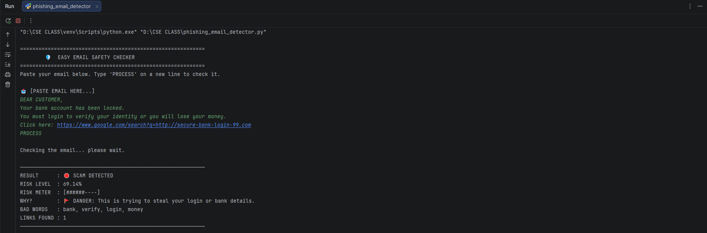
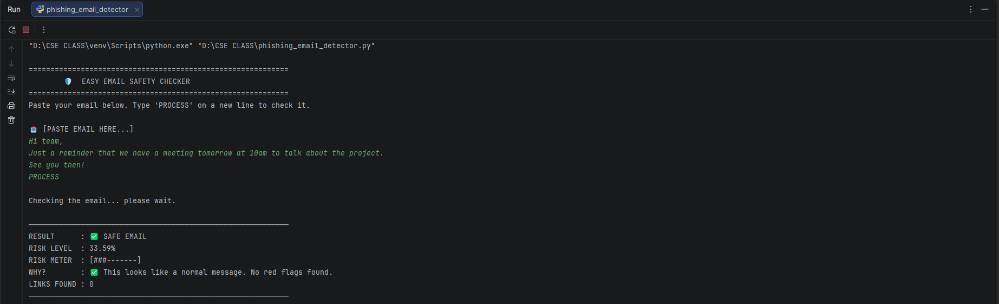
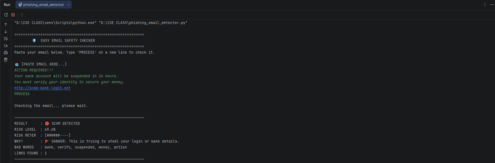
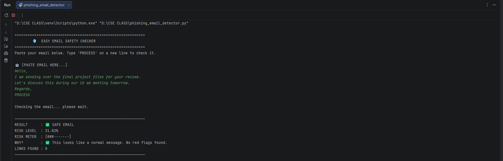

# 🛡️ Email Phishing Detector

The **Email Phishing Detector** is a comprehensive security tool designed to identify, analyze, and flag malicious emails. By leveraging a hybrid architecture that combines **Natural Language Processing (NLP)** with **Heuristic Behavioral Analysis**, this tool provides a robust first line of defense against social engineering attacks.

---

## 🔍 System Overview

Phishing attacks have become increasingly sophisticated, often bypassing traditional spam filters by using "Clean" domains or complex social engineering tactics. This detector goes beyond simple blacklists by analyzing the **intent** and **structure** of the message text.

### Detection Methodology
The system processes every email through a three-stage verification pipeline:

| Stage | Name | Description |
| :--- | :--- | :--- |
| **Stage 1** | **Text Vectorization** | Converts raw text into numerical data using `TF-IDF`, allowing the AI to "measure" word importance and context. |
| **Stage 2** | **ML Classification** | A `Naive Bayes` classifier determines the mathematical probability of a scam based on historical patterns. |
| **Stage 3** | **Heuristic Audit** | Checks for "Environmental" red flags like link density, urgency markers, and aggressive capitalization. |

---
## 📸 Screenshots & Visuals

### Input / Output 1  


### Input / Output 2  


### Input / Output 3  


### Input / Output 4  


### 1. Application Startup
*What the user sees when launching the detector in the terminal.*

### 2. Risk Detection Example
*Example of a high-risk phishing email being flagged by the system.*

## ✨ Key Features

* **Intelligent Text Cleaning:** Automatically normalizes case, removes noisy symbols, and identifies hidden URL patterns.
* **Weighted Risk Scoring:** Calculates a risk percentage (0% - 100%) based on both AI confidence and hard-coded triggers.
* **Urgency Analysis:** Flags aggressive punctuation and time-sensitive threats (e.g., "Account suspended").
* **Visual Risk Meter:** Provides an immediate visual representation of the threat level.
* **Transparency Reports:** Lists specific "Bad Words" and behavioral triggers found in the text.

---

## 🚀 Installation & Setup

### Prerequisites
Ensure you have **Python 3.8+** installed on your system.

### Dependency Installation
The detector requires `pandas` and `scikit-learn`. Install them using:

```bash
pip install pandas scikit-learn
## 📖 Operational Guide

1.  **Run the Tool:** Execute `python phishing_detector.py` in your terminal.
2.  **Paste Email:** Copy the body of the suspicious email into the console.
3.  **Process:** Type `PROCESS` on a new line and press Enter.
4.  **Analyze:** Review the generated report for risk scores and flags.

---

## 🛠️ Advanced Customization

Developers can refine accuracy by modifying:

*   **`_train_engine`**: Add more labeled examples of "Safe" vs "Phishing" emails to the training dictionary.
*   **`risk_keywords`**: Add modern scam terms (e.g., "crypto", "wallet", "overdue", "giftcard").

---

## 🛡️ Security Best Practices

*   **The "Hover" Rule:** Always hover your mouse over links to see the actual destination URL before clicking.
*   **MFA is Mandatory:** Always enable Multi-Factor Authentication on sensitive accounts.
*   **Verify Offline:** If a request seems urgent or unusual, contact the sender via a known separate channel (phone call or Slack).

---

## 📈 Future Enhancements

*   **Advanced URL Reputation:** Integrating external APIs (like VirusTotal) to check global blacklists.
*   **Attachment Scanning:** Implementing file-extension checks for dangerous attachments (e.g., `.zip`, `.exe`).
*   **GUI Development:** Moving from a command-line interface to a clean Desktop Dashboard.

---


---

## 🏁 Conclusion

The **Email Phishing Detector** provides a streamlined, AI-driven approach to identifying digital threats. By combining mathematical probability with common-sense security heuristics, it empowers users to evaluate their inbox with greater technical scrutiny. As phishing tactics continue to evolve, this tool serves as a foundation for building more resilient, data-informed security habits.
